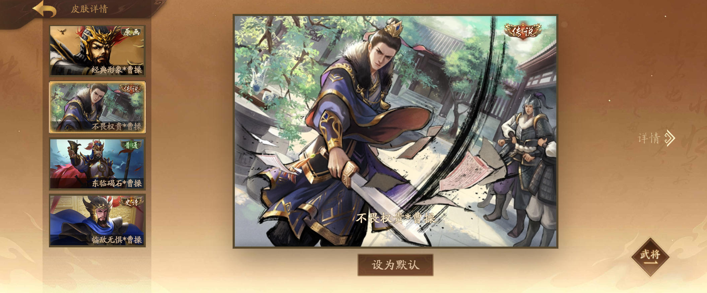

## 添加皮肤

这里讲述如何添加皮肤资源

## 基本方法

可以添加露头和不露头两套皮肤（包括原皮）。

推荐平时使用露头皮肤的用户同时设置添加露头和不露头2套皮肤资源，可增加皮肤详情页的观赏性。

在设置界面中皮肤的默认路径已设置为无名杀根目录下的image/character，可追加设置一套露头的武将原皮。若不添加露头原皮文件夹却在设置中开启了露头模式，则将会丢失武将显示区的皮肤显示。若你只有一套露头原皮又不想补充普通原皮，且已将露头原皮覆盖了image/character中的原皮的话，最好的解决办法就是将露头原皮文件夹也指向image/character。

同样支持外链皮肤资源文件夹，无需将皮肤资源再次复制一套造成储存空间浪费。

## 皮肤使用解惑

程序在修改了皮肤目录等大型操作后会全量搜索指定文件夹中的皮肤文件（耗时5秒左右，根据终端配置决定），并生成皮肤指纹存在配置中。平时少量增删皮肤只会对照指纹文件进行增量扫描（几乎无感），所以少量增删皮肤无需点击设置中的全量扫描皮肤。

那么什么情况下需要手动点击全量扫描皮肤呢：

1、更改了皮肤品质（因为皮肤配置全存在cache里，不刷新一遍不会生效）；

2、添加的皮肤重启后还是没看到，可尝试手动刷新。

另外阐述一下扩展使用露头/不露头皮肤文件的逻辑，若你只使用不露头皮肤的话，可以不用看这几点：

1、在【武将/皮肤】页面中，武将会使用用户指定的皮肤，即用户指定露头皮肤，只会显示露头皮肤文件夹内的皮肤，指定不露头皮肤，只会显示普通皮肤文件夹内的皮肤，若用户文件夹选错，将无法读取到皮肤资源从而显示不出皮肤来。

2、在【武将详情/皮肤详情】页面中，若用户是露头皮肤使用者，武将还是会优先使用非露头皮肤文件夹中的皮肤（若用户已指定过相关文件夹）来保持观感，若没有指定过则会使用露头皮肤文件夹中的皮肤。当然如果你本身就不用露头皮肤就没这方面的顾虑。

3、【皮肤详情】页中的大图优先使用原画文件夹中的皮肤，所以可能会出现横版皮肤，例如：

## 皮肤共享

支持【千幻聆音】扩展的皮肤共享文件，在设置中选择skinShare.js的文件位置即可实现该功能。

皮肤共享将会全面共享其皮肤资源、语音资源、台词资源。

## 皮肤台词

皮肤台词与【千幻聆音】扩展一样，读取皮肤文件夹的skinInfo.js文件，具体设置方法请参考相关说明，在此不再赘述。

若没有设置skinInfo.js，或者当前为武将原皮，将会默认使用无名杀本体自带的台词文件。

## 皮肤设置重点

在设置页面对皮肤的任何设置进行了修改，都需要重启才能生效，包括不限于指定皮肤资源文件夹，更改皮肤等阶显示等等

